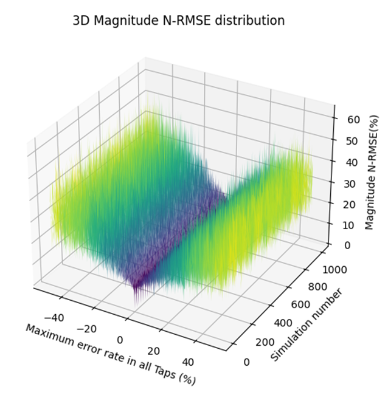

# Hilbert Transform Precision Analysis
Explore the precision of the fractional Hilbert transform(FHT) with this Python repository. Analyze the sensitivity to power and delay inaccuracies in both nonuniformly and uniformly spaced delay-line filters' FHT implementations. Examine the system's sensitivity to inaccuracies in power and delay, specifically focusing on how the magnitude and phase of the system are affected.

## Contents

- `FHT_ErrorAnalyer.py`: Python class for his class for determine the error in the fractional Hilbert transform(FHT) when using nonuniformly delayed taps coefficients approach with empirical probabilities.

- `main.py`: Python script containing visualizations of the impact of error rates on tap coefficients.

## Usage

1. Clone the repository:

```bash
git clone https://github.com/marioannier/HilbertTransformPrecisionAnalysis.git
```

2. Navigate to the repository:

```bash
cd HilbertTransformPrecisionAnalysis
```

3. Run the analysis scripts:

```bash
python main.py
```

4. Explore the results for detailed visualizations ad play with the parameters:

- **`err_range`**: The range of error rates in taps, specified as a percentage. In this case, it is set to `[-50, 50]`, indicating a variation between -10% and +10%. This parameter explores the impact of inaccuracies in the delay-line filter coefficients.

- **`num_sim`**: Number of simulations. It is set to `1001` in this repository, indicating that the simulation will be performed 1001 times. Each simulation explores the Hilbert transform's precision under different conditions of error rates.

- **`order`**: The order (`ρ`) of the fractional Hilbert transform. In this case, it is set to `1`. The order determines the phase shift of the transform results around the central frequency.

- **`number_coef`**: Number of coefficients used for building the fractional Hilbert transform. It is set to `7`, implying that the transform is constructed using 7 coefficients in the delay-line filter.

- **`f_center`**: Central frequency for the fractional Hilbert transform. It is set to `8e9` (8 gigahertz) and represents the frequency around which the precision analysis is centered.

These parameters collectively define the conditions under which the precision analysis of the Hilbert transform is conducted, allowing the exploration of the system's sensitivity to errors in power and delay.


### Results for 1001 error values (-50% and 50%) 

| 2D Magnitude        | 2D Phase                |
|---------------------|-------------------------|
|  |  |

| 3D Magnitude            | 3D Phase                |
|-------------------------|-------------------------|
|  |  |


## Findings

The analysis reveals that the RMSE between the zero-error response and the simulation tends to increase as the maximum value of introduced error increases.